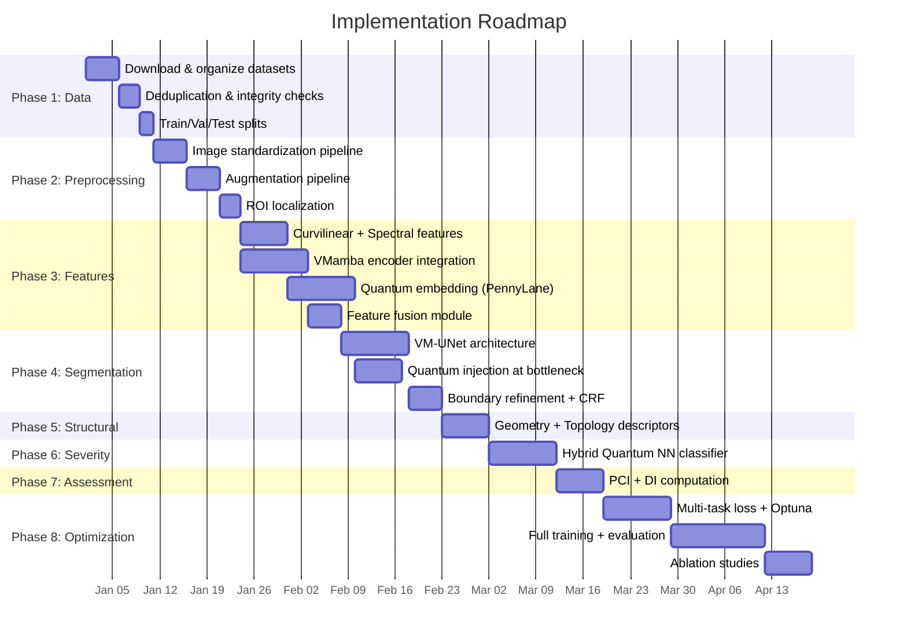

# Quantum-Enhanced Pavement Crack Detection & Assessment System
## Complete Architecture Document

---

## Architecture Flow Diagram


---

## Table of Contents

1. [Project Overview](#1-project-overview)
2. [Dataset Selection & Rationale](#2-dataset-selection--rationale)
3. [Phase 1 — Data Acquisition Layer](#3-phase-1--data-acquisition-layer)
4. [Phase 2 — Data Preprocessing & Enhancement Layer](#4-phase-2--data-preprocessing--enhancement-layer)
5. [Phase 3 — Multi-Domain Feature Learning & Quantum Encoding](#5-phase-3--multi-domain-feature-learning--quantum-encoding)
6. [Phase 4 — Quantum-Enhanced Crack Segmentation Layer](#6-phase-4--quantum-enhanced-crack-segmentation-layer)
7. [Phase 5 — Crack Structural Descriptor Learning Layer](#7-phase-5--crack-structural-descriptor-learning-layer)
8. [Phase 6 — Quantum-Enhanced Severity Prediction Layer](#8-phase-6--quantum-enhanced-severity-prediction-layer)
9. [Phase 7 — Pavement Damage Assessment Layer](#9-phase-7--pavement-damage-assessment-layer)
10. [Phase 8 — Multi-Objective Optimization & Training Layer](#10-phase-8--multi-objective-optimization--training-layer)
11. [Final Outputs](#11-final-outputs)
12. [Technology Stack Summary](#12-technology-stack-summary)
13. [Hardware Requirements](#13-hardware-requirements)
14. [Implementation Roadmap](#14-implementation-roadmap)

---

## 1. Project Overview

This project implements an **8-phase pipeline** for automated pavement crack detection, segmentation, severity classification, and damage assessment. The system uniquely integrates **classical deep learning** (Vision Mamba / State Space Models) with **quantum-classical hybrid computing** (Variational Quantum Circuits via PennyLane) to achieve superior feature representation and classification accuracy.

### Core Objectives

| Objective | Output | Notation |
|-----------|--------|----------|
| **Pixel-level crack segmentation** | Binary crack mask | $M_{seg}$ |
| **Severity classification** | 4-level severity label | $S$ |
| **Pavement damage quantification** | Damage Index | $DI$ |
| **Condition assessment** | Pavement Condition Index (0–100) | $PCI$ |

### System Data Flow Summary

$$I_{raw} \xrightarrow{\text{Phase 1}} I_{pre} \xrightarrow{\text{Phase 2-3}} \{F_{curv}, F_{tex}, F_{sem}, F_q\} \xrightarrow{\text{Phase 4}} M_{seg} \xrightarrow{\text{Phase 5}} F_g \xrightarrow{\text{Phase 6}} S \xrightarrow{\text{Phase 7}} (PCI, DI) \xrightarrow{\text{Phase 8}} \Theta^*$$

---

## 2. Dataset Selection & Rationale

### Available Datasets Analyzed

| # | Dataset | Source | Images | Annotation Type | Resolution | Suitability |
|---|---------|--------|--------|-----------------|------------|-------------|
| 1 | **Mendeley Crack (z3nx8n396g)** | [Mendeley](https://data.mendeley.com/datasets/z3nx8n396g/3) | ~40,000 | Classification (Positive/Negative) | 227×227 | Classification only |
| 2 | **CrackForest (CFD)** | [GitHub](https://github.com/cuilimeng/CrackForest-dataset) | 118 | Pixel-level binary masks | 480×320 | Segmentation benchmark |
| 3 | **Mendeley Concrete Crack (88kdyyc73h)** | [Mendeley](https://data.mendeley.com/datasets/88kdyyc73h/1) | ~20,000 | Classification (Positive/Negative) | 227×227 | Classification only |
| 4 | **Mendeley Pavement (gsbmknrhkv)** | [Mendeley](https://data.mendeley.com/datasets/gsbmknrhkv/6) | ~7,000+ | Classification with severity | Variable | Severity classification |
| 5 | **CrackDataset_DL_HY** | [GitHub](https://github.com/juhuyan/CrackDataset_DL_HY) | ~3,000+ | Pixel-level masks | Variable | Segmentation |
| 6 | **RoadDamageDetector (RDD)** | [GitHub](https://github.com/sekilab/RoadDamageDetector) | 9,053 | Bounding boxes (VOC format) | 600×600 | Object detection |
| 7 | **DeepCrack** | [GitHub](https://github.com/yhlleo/DeepCrack) | 537 | Pixel-level binary masks | 544×384 | Segmentation benchmark |
| 8 | **CrackVision12K** | [UCL Repository](https://rdr.ucl.ac.uk/articles/dataset/CrackVision12K/26946472) | 12,000 | Pixel-level masks (unified) | Variable (standardized) | **Best for training** |
| 9 | **RDD Images** | [GitHub](https://github.com/sekilab/RoadDamageDetector/tree/master/images) | Subset of #6 | Same as #6 | 600×600 | Same as #6 |

### Selection Decision

> [!IMPORTANT]
> **Training Dataset (1):** CrackVision12K  
> **Testing Datasets (3):** CrackForest (CFD), DeepCrack, RoadDamageDetector (RDD)

#### Training: CrackVision12K — Why?

| Criterion | CrackVision12K Advantage |
|-----------|--------------------------|
| **Size** | 12,000 images — largest unified crack dataset available, sufficient for deep learning without extreme augmentation dependency |
| **Annotation Quality** | Pixel-level binary segmentation masks with **unified annotation standards** across all images |
| **Diversity** | Derived from 13 source datasets (Aigle-RN, ESAR, LCMS, CRACK500, CrackLS315, CRKWH100, CrackTree260, DeepCrack, GAPS384, Masonry, Stone331, CFD, SDNet2018) — covers road cracks, concrete cracks, masonry cracks, and structural cracks |
| **Class Balance** | Pre-filtered to include only images with ≥5,000 crack pixels — mitigates the severe class imbalance problem endemic to crack datasets |
| **Consistency** | Image processing techniques applied uniformly to standardize annotations from 13 different labeling conventions |
| **Research Backing** | Published with Hybrid-Segmentor (arXiv:2409.02866) — peer-reviewed methodology |

> [!NOTE]
> CrackVision12K **already incorporates** cleaned versions of CrackForest and DeepCrack in its training set. For testing, we will use the **original, unprocessed** versions of these datasets to ensure a rigorous cross-dataset generalization evaluation.

#### Testing Dataset 1: CrackForest (CFD) — Why?

- **118 images** with expert-annotated pixel-level ground truth
- **Benchmark standard** in pavement crack segmentation literature — enables direct comparison with published methods (SegNet, U-Net, DeepCrack, etc.)
- **Urban road cracks** — tests generalization to a specific, well-studied domain
- **Different annotation style** from CrackVision12K — validates robustness to annotation variation

#### Testing Dataset 2: DeepCrack — Why?

- **537 images** with fine-grained pixel-level annotations
- Captures **diverse crack patterns** including thin hairline cracks, branching networks, and wide structural failures
- Published benchmark with established baseline metrics (ODS, OIS, AP)
- **Different image acquisition conditions** from CrackVision12K sources

#### Testing Dataset 3: RoadDamageDetector (RDD) — Why?

- **9,053 images** from real-world road inspection (Japan, India, Czech Republic)
- **Bounding box annotations** (we convert to pseudo-segmentation ROIs for evaluation)
- Tests the system under **international, real-world deployment conditions** — multiple countries, varying road types, diverse camera setups
- **Multi-class damage types**: longitudinal cracks (D00), transverse cracks (D01), alligator cracks (D10), potholes (D20) — validates our severity classification
- Largest testing set — provides statistically robust evaluation

> [!WARNING]
> RDD uses bounding-box annotations, not pixel-level masks. For segmentation evaluation on RDD, we will use **bounding-box IoU** and **damage-level classification accuracy** rather than pixel-wise metrics. This provides a complementary evaluation dimension (detection + classification) alongside pixel-level metrics from CFD and DeepCrack.

---

## 3. Phase 1 — Data Acquisition Layer

### Purpose
Collect, organize, and prepare raw pavement images from the selected datasets for downstream processing.

### Architecture

```
CrackVision12K (Training)     CrackForest / DeepCrack / RDD (Testing)
        │                                    │
        ▼                                    ▼
   Download & Verify               Download & Verify
   (SHA256 Checksums)              (SHA256 Checksums)
        │                                    │
        ▼                                    ▼
   Unified Directory              Separate Test Dirs
   Structure                      (per-dataset)
        │                                    │
        ▼                                    ▼
   Train/Val Split                Test-Only Organization
   (80/20 stratified)             (No leakage guarantee)
        │
        ▼
   OUTPUT: I_raw (Raw Pavement Images)
```

### Detailed Steps

**Step 1.1: Dataset Download & Integrity Verification**
- Download CrackVision12K from UCL Research Data Repository (ZIP, ~2.5 GB)
- Download CrackForest from GitHub (including `groundTruth/` and `image/` directories)
- Download DeepCrack from GitHub (train/test splits pre-defined by authors)
- Download RDD from GitHub (XML annotations in VOC format)
- Verify all downloads via SHA256/MD5 checksums where available

**Step 1.2: Unified Directory Structure**
```
data/
├── train/                          # CrackVision12K
│   ├── images/                     # 9,600 images (80%)
│   └── masks/                      # Corresponding binary masks
├── val/                            # CrackVision12K
│   ├── images/                     # 2,400 images (20%)
│   └── masks/
└── test/
    ├── crackforest/
    │   ├── images/                 # 118 images
    │   └── masks/
    ├── deepcrack/
    │   ├── images/                 # 537 images
    │   └── masks/
    └── rdd/
        ├── images/                 # 9,053 images
        └── annotations/           # XML bounding boxes
```

**Step 1.3: Data Integrity & Leakage Prevention**
- Compute perceptual hashes (pHash) for all images across training and test sets
- Remove any near-duplicate images between CrackVision12K training set and the test datasets (since CV12K was derived from CFD/DeepCrack, some overlap exists)
- Log all removed images for reproducibility

### Technology Choices

| Component | Technology | Rationale |
|-----------|-----------|-----------|
| Download automation | Python `requests` + `tqdm` | Simple, reliable HTTP downloads with progress bars |
| Integrity verification | `hashlib` (SHA256) | Standard cryptographic verification |
| Deduplication | `imagehash` (pHash) | Perceptual hashing catches resized/recompressed duplicates |
| Directory management | `pathlib` + `shutil` | Cross-platform file operations |
| Train/Val split | `sklearn.model_selection.train_test_split` | Stratified splitting with reproducible random seeds |

---

## 4. Phase 2 — Data Preprocessing & Enhancement Layer

### Purpose
Standardize, enhance, and augment raw images to improve model training stability and crack visibility across varying acquisition conditions.

### Architecture

```
I_raw (Raw Images)
    │
    ├──► [1] Image Standardization
    │         ├── Resize to 512×512 (bilinear interpolation)
    │         ├── Convert to RGB (handle grayscale/RGBA)
    │         └── Normalize to [0,1] float32
    │
    ├──► [2] Noise Suppression
    │         ├── Non-Local Means Denoising (h=10, templateWindowSize=7)
    │         └── Bilateral Filter (d=9, σ_color=75, σ_space=75)
    │
    ├──► [3] Illumination Enhancement
    │         ├── CLAHE (Contrast Limited Adaptive Histogram Equalization)
    │         │     clipLimit=2.0, tileGridSize=(8,8)
    │         └── Applied to L-channel of LAB color space
    │
    ├──► [4] Data Augmentation
    │         ├── Random Horizontal/Vertical Flip (p=0.5)
    │         ├── Random Rotation (±15°)
    │         ├── Random Crop & Resize (scale: 0.8–1.0)
    │         ├── Color Jitter (brightness=0.2, contrast=0.2)
    │         ├── Elastic Transform (α=120, σ=12)
    │         └── Gaussian Noise (σ=0.01)
    │
    └──► [5] Adaptive Pavement Region Localization
              ├── GrabCut-based foreground segmentation
              ├── Otsu thresholding for ROI estimation
              └── Crop to pavement-only region → re-resize to 512×512
    │
    ▼
OUTPUT: I_pre (Enhanced & Preprocessed Pavement Images)
```

### Detailed Steps

**Step 2.1: Image Standardization**
- **Why 512×512?** Balances spatial resolution for crack detail preservation with computational feasibility for quantum circuit simulation. Powers of 2 are optimal for GPU tensor operations.
- **Why float32 [0,1]?** Standard normalization for neural network convergence stability. ImageNet mean/std normalization applied: μ = [0.485, 0.456, 0.406], σ = [0.229, 0.224, 0.225].

**Step 2.2: Noise Suppression**
- **Why Non-Local Means over Gaussian blur?** NLM preserves edge structure (critical for thin crack boundaries) while removing sensor noise. Gaussian blur would smear fine cracks.
- **Why Bilateral Filter?** Additional edge-preserving smoothing that reduces texture noise on asphalt surfaces without destroying crack edges.

**Step 2.3: CLAHE Illumination Enhancement**
- **Why CLAHE over global histogram equalization?** Pavement images have highly non-uniform illumination (shadows, direct sunlight, artificial lighting). CLAHE operates on local tiles, preventing global contrast distortion while enhancing crack visibility in shadowed regions.
- **Why LAB color space?** Applying CLAHE to only the L (lightness) channel avoids color artifacts that occur when equalizing RGB channels independently.

**Step 2.4: Data Augmentation**
- **Why Elastic Transform?** Simulates natural crack deformation patterns — cracks are inherently non-rigid structures. This is the single most impactful augmentation for crack segmentation.
- **Why conservative rotation (±15°)?** Pavement images have a dominant horizontal orientation. Excessive rotation creates unrealistic perspectives.
- All augmentations are applied **jointly** to both image and corresponding mask to maintain pixel-level alignment.

**Step 2.5: Adaptive ROI Localization**
- **Why?** Many pavement images contain non-pavement regions (curbs, vehicles, vegetation) that confuse the segmentation model. Isolating the pavement region improves signal-to-noise ratio.
- Applied selectively — only when non-pavement content exceeds 20% of image area (estimated via simple background statistics).

### Technology Choices

| Component | Technology | Rationale |
|-----------|-----------|-----------|
| Image I/O | OpenCV (`cv2`) | Industry standard, hardware-accelerated image processing |
| Augmentation | `albumentations` | Fastest augmentation library; supports joint image+mask transforms; GPU-compatible |
| Normalization | `torchvision.transforms` | Seamless integration with PyTorch data pipeline |
| CLAHE | `cv2.createCLAHE()` | Optimized C++ backend, proven in medical/industrial imaging |
| ROI detection | `cv2.grabCut()` + Otsu | No training required, works well for foreground/background separation |

---

## 5. Phase 3 — Multi-Domain Feature Learning & Quantum Encoding

### Purpose
Extract complementary features across multiple domains (geometric, spectral, semantic) and encode them into a hybrid classical-quantum feature space for richer representation.

### Architecture

```
I_pre (Preprocessed Images)
    │
    ├──► [1] Multi-Scale Curvilinear Feature Learning
    │         ├── Frangi Vesselness Filter (σ = {1,2,4,8} multi-scale)
    │         ├── Hessian Ridge Detection (eigenvalue analysis)
    │         └── Shape Descriptors (curvature, orientation)
    │         OUTPUT: F_curv ∈ ℝ^(H×W×C₁)
    │
    ├──► [2] Spectral-Texture Feature Learning
    │         ├── Wavelet Scattering Transform (Morlet wavelets, J=3, L=8)
    │         ├── Gabor Filter Bank (8 orientations × 5 frequencies)
    │         └── Persistent Homology (topological features)
    │         OUTPUT: F_tex ∈ ℝ^(H×W×C₂)
    │
    ├──► [3] Vision Mamba Semantic Learning
    │         ├── VMamba Encoder (SS2D blocks, bidirectional scanning)
    │         ├── Selective State Space Model (S6)
    │         └── Multi-scale feature pyramids
    │         OUTPUT: F_sem ∈ ℝ^(H×W×C₃)
    │
    ├──► [4] Multi-Domain Feature Fusion
    │         ├── Concatenation: [F_curv; F_tex; F_sem]
    │         ├── Cross-Attention mechanism (learnable queries)
    │         └── Adaptive channel weighting (SE-Net style)
    │         OUTPUT: F_fusion ∈ ℝ^(H×W×C_f)
    │
    ├──► [5] Trainable Quantum Feature Embedding
    │         ├── Parameterized Embedding: Classical → |ψ⟩
    │         ├── Angle Encoding: x_i → RY(x_i)|0⟩
    │         └── Amplitude Encoding (for high-dim features)
    │         OUTPUT: |ψ⟩ (Quantum State)
    │
    └──► [6] Variational Quantum Circuit (VQC)
              ├── RY-RZ Parameterized Rotation Gates
              ├── CNOT Entanglement Layers (linear topology)
              ├── Measurement: Pauli-Z expectation values
              └── Circuit Depth: 4–8 layers (tuned via Phase 8)
              OUTPUT: F_q ∈ ℝ^(n_qubits)
    │
    ▼
OUTPUT: F_q (Hybrid Classical-Quantum Feature Space)
```

### Detailed Steps

**Step 3.1: Multi-Scale Curvilinear Feature Learning**

- **What it does:** Detects elongated, tube-like structures (cracks) by analyzing the second-order differential structure (Hessian matrix) of the image at multiple scales.
- **Why Frangi Vesselness?** Originally designed for blood vessel detection in medical imaging — cracks share the same geometric property: thin, elongated structures with high contrast against background. Multi-scale analysis (σ = 1,2,4,8) captures cracks of varying widths.
- **Why Hessian Ridge Detection?** Eigenvalue analysis of the Hessian matrix distinguishes between blob-like features (noise/potholes), ridge-like features (cracks), and flat regions (intact pavement). The eigenvalue ratio λ₁/λ₂ is a direct discriminant for "crack-ness."
- **Implementation:** scikit-image `frangi()`, `hessian_matrix()`, `hessian_matrix_eigvals()`

**Step 3.2: Spectral-Texture Feature Learning**

- **What it does:** Captures frequency-domain texture information that distinguishes cracked pavement texture from intact surface patterns.
- **Why Wavelet Scattering?** Scattering transforms provide **translation-invariant, deformation-stable** feature representations. Unlike raw wavelet coefficients, scattering features are robust to small crack position shifts — essential for consistent feature extraction.
- **Why Gabor Filter Bank?** Gabor filters are optimal for detecting oriented textures at specific frequencies. Cracks have strong directional energy — a Gabor bank with 8 orientations captures crack direction regardless of angle.
- **Why Persistent Homology?** Topological Data Analysis (TDA) captures the **connectivity and branching structure** of crack networks — information that pixel-level methods miss entirely. Connected components (H₀) and loops (H₁) in persistence diagrams directly encode crack network complexity.
- **Implementation:** `kymatio` (Wavelet Scattering), `scikit-image` (Gabor), `ripser`/`giotto-tda` (Persistent Homology)

**Step 3.3: Vision Mamba Semantic Learning**

- **What it does:** Extracts high-level semantic features using a Vision Mamba (VMamba) backbone based on Selective State Space Models (S6).

- **Why Vision Mamba over Vision Transformer (ViT)?**

| Property | ViT (Transformer) | VMamba (Mamba) |
|----------|-------------------|----------------|
| Complexity | $O(n^2)$ (quadratic in sequence length) | $O(n)$ (linear) |
| Memory | High (stores full attention matrix) | Low (recurrent state) |
| Long-range dependency | Excellent | Excellent (via state space) |
| 512×512 images | 256K tokens → impractical without windowing | Handles natively via SS2D scan |
| Training speed | Slower | Faster |

- **Why not CNN (ResNet/EfficientNet)?** CNNs have limited receptive fields — a crack spanning the entire image requires very deep networks or dilated convolutions. Mamba's state-space formulation captures global context in a single pass.
- **Architecture:** VMamba-Tiny as backbone (pretrained on ImageNet-1K), with SS2D (Selective Scan 2D) blocks that perform bidirectional scanning across spatial dimensions.
- **Implementation:** `mamba-ssm` (official Mamba implementation) + custom VMamba encoder from [VMamba repository](https://github.com/MzeroMiko/VMamba)

**Step 3.4: Multi-Domain Feature Fusion**

- **What it does:** Combines curvilinear, spectral-texture, and semantic features into a unified representation using attention-based fusion.
- **Why Cross-Attention?** Different feature domains have different informativeness across spatial locations. Cross-attention allows each domain to "query" the others — e.g., semantic features can attend to curvilinear evidence at ambiguous regions.
- **Why Adaptive Channel Weighting (SE-Net)?** Squeeze-and-Excitation blocks learn channel-wise importance, automatically suppressing irrelevant channels (e.g., Gabor responses at orientations with no cracks).
- **Implementation:** Custom PyTorch `nn.Module` with `nn.MultiheadAttention` + `SE-Block`

**Step 3.5: Trainable Quantum Feature Embedding**

- **What it does:** Maps classical feature vectors into quantum state vectors using parameterized quantum circuits.
- **Why Angle Encoding?** Each classical feature value $x_i$ is mapped to a rotation angle: $RY(x_i)|0\rangle$. This is the most resource-efficient encoding — requires only $n$ qubits for $n$ features. Trainable scaling parameters $\theta_i$ allow the embedding to adapt: $RY(\theta_i \cdot x_i)$.
- **Qubit Count:** 8–16 qubits (simulated). We compress the fused feature vector $F_{fusion}$ to 8–16 dimensions via a learnable linear projection before embedding.
- **Why not Amplitude Encoding?** Amplitude encoding can encode $2^n$ features in $n$ qubits but requires exponentially deep state preparation circuits. Not practical on simulated backends.

**Step 3.6: Variational Quantum Circuit (VQC)**

- **What it does:** Processes quantum-embedded features through parameterized quantum gates to learn quantum feature representations.
- **Circuit Design:**
  ```
  Layer 1: RY(θ₁) ⊗ RZ(θ₂) on each qubit
  Layer 2: CNOT entanglement (linear chain)
  Layer 3: RY(θ₃) ⊗ RZ(θ₄) on each qubit
  Layer 4: CNOT entanglement (circular)
  ... (repeat for depth D = 4–8 layers)
  Measurement: ⟨Z⟩ on each qubit → F_q ∈ ℝⁿ
  ```
- **Why RY-RZ gates?** This gate set provides universal single-qubit rotation capability. Combined with CNOT entanglement, the circuit is a universal quantum classifier.
- **Why simulated quantum computing?** Physical quantum hardware (IBM Quantum, Google Sycamore) has high noise and limited qubit counts. PennyLane's `default.qubit` simulator provides **noise-free, unlimited-qubit** simulation that enables research on quantum advantages without hardware constraints.

### Technology Choices

| Component | Technology | Rationale |
|-----------|-----------|-----------|
| Curvilinear features | `scikit-image` (Frangi, Hessian) | Proven implementations, NumPy-compatible |
| Wavelet Scattering | `kymatio` | GPU-accelerated scattering transforms |
| Gabor filters | `scikit-image.filters.gabor` | Standard implementation |
| Persistent Homology | `giotto-tda` + `ripser` | Efficient TDA with scikit-learn API |
| Vision Mamba | `mamba-ssm` + VMamba codebase | Official implementation with CUDA kernels |
| Feature fusion | PyTorch `nn.MultiheadAttention` | Native PyTorch, efficient on GPU |
| Quantum circuits | **PennyLane** (`pennylane`) | Best quantum ML library; PyTorch integration via `qml.qnode` with `interface='torch'`; differentiable quantum circuits enable end-to-end gradient backpropagation |
| Quantum simulation | PennyLane `default.qubit` | Exact statevector simulation; supports automatic differentiation |

> [!TIP]
> **Why PennyLane over Qiskit?** PennyLane is designed specifically for quantum machine learning with native auto-differentiation support. It integrates seamlessly with PyTorch via the `torch` interface, allowing quantum circuit parameters to be optimized jointly with classical neural network parameters using standard optimizers (Adam, SGD). Qiskit is more hardware-oriented and lacks this tight ML integration.

---

## 6. Phase 4 — Quantum-Enhanced Crack Segmentation Layer

### Purpose
Produce pixel-level binary crack segmentation masks using a hybrid quantum-classical encoder-decoder network.

### Architecture

```
F_fusion (Fused Classical Features) + F_q (Quantum Features)
    │
    ├──► [1] Quantum Feature Extractor (Q_f)
    │         ├── VQC applied to patch-level features
    │         ├── 8-qubit circuits per 16×16 patch
    │         └── Output: Quantum-enhanced patch embeddings
    │
    ├──► [2] Quantum Attention Module (Q_a)
    │         ├── Quantum kernel-based attention
    │         ├── Quantum state fidelity as attention score
    │         └── Attends to crack-relevant spatial regions
    │
    ├──► [3] Quantum-Enhanced VM-UNet (F_seg)
    │         ├── ENCODER: VMamba SS2D blocks (4 stages)
    │         │     Stage 1: 512×512 → 256×256, C=64
    │         │     Stage 2: 256×256 → 128×128, C=128
    │         │     Stage 3: 128×128 → 64×64, C=256
    │         │     Stage 4: 64×64 → 32×32, C=512
    │         ├── BOTTLENECK: Quantum Feature Injection
    │         │     Classical features → VQC → Quantum features
    │         │     Concatenate with classical bottleneck
    │         ├── DECODER: Transpose Conv + Skip Connections
    │         │     Stage 4': 32×32 → 64×64 (+ skip from Stage 3)
    │         │     Stage 3': 64×64 → 128×128 (+ skip from Stage 2)
    │         │     Stage 2': 128×128 → 256×256 (+ skip from Stage 1)
    │         │     Stage 1': 256×256 → 512×512
    │         └── OUTPUT HEAD: 1×1 Conv → Sigmoid → P(crack)
    │
    └──► [4] Boundary Refinement Head (F_ref)
              ├── Edge-aware CRF (Conditional Random Field)
              ├── Boundary-sensitive loss (weighted BCE on boundaries)
              └── Morphological post-processing (small object removal)
    │
    ▼
OUTPUT: M_seg (Binary Crack Segmentation Mask) + F_ref (Refined Features)
```

### Detailed Steps

**Step 4.1: Quantum Feature Extractor**
- **How it works:** The 512×512 feature maps are divided into 16×16 patches (1,024 patches total). Each patch's feature vector is compressed to 8 dimensions and processed through a dedicated VQC.
- **Why patch-level?** Processing the entire image as one quantum state would require an impractical number of qubits. Patch-level processing is computationally tractable while still injecting quantum-enhanced features at fine spatial granularity.
- **Efficiency:** We use a **shared VQC** with the same architecture across all patches (parameter sharing). Only patch embeddings differ.

**Step 4.2: Quantum Attention Module**
- **How it works:** Computes attention scores using quantum kernel methods. For two patches $p_i$ and $p_j$, the attention score is the **quantum state fidelity**: $K(p_i, p_j) = |\langle\psi(p_i)|\psi(p_j)\rangle|^2$.
- **Why quantum attention?** Quantum kernels can compute similarity in exponentially high-dimensional Hilbert spaces — potentially capturing feature relationships that classical attention matrices miss.
- **Practical note:** Quantum attention is applied **only at the bottleneck** (32×32 = 1,024 patches) to keep simulation cost manageable.

**Step 4.3: Quantum-Enhanced VM-UNet**
- **Why VM-UNet as backbone?** VM-UNet (Vision Mamba UNet) uses State Space Model (SSM) blocks instead of Transformer attention in the encoder. This provides:
  - Linear complexity: $O(n)$ vs $O(n^2)$ for Transformer-based UNets (Swin-UNet)
  - Global receptive field from the first layer (critical for long, connected cracks)
  - Lower memory footprint — enables 512×512 inputs on a single GPU
- **Quantum injection:** At the bottleneck (lowest resolution), quantum features are concatenated with classical features. This strategic placement means quantum circuits process compressed representations (only 32×32×512 = 524K values) rather than full-resolution images.
- **Skip connections:** Standard U-Net skip connections preserve spatial detail from encoder to decoder, critical for precise crack boundary delineation.

**Step 4.4: Boundary Refinement Head**
- **Why CRF?** Semantic segmentation outputs tend to have ragged boundaries. CRFs enforce spatial consistency by penalizing label disagreements between visually similar neighboring pixels.
- **Boundary-sensitive loss:** Crack boundaries are the most information-rich and error-prone regions. We compute a binary dilation of the ground truth mask (3-pixel kernel) to identify boundary pixels, then apply 3× higher loss weight on these pixels.
- **Morphological cleanup:** Remove connected components < 50 pixels (noise), fill single-pixel holes in crack predictions.

### Technology Choices

| Component | Technology | Rationale |
|-----------|-----------|-----------|
| VM-UNet backbone | Custom PyTorch + `mamba-ssm` | Combines VMamba encoder with U-Net decoder |
| Quantum modules | PennyLane `qml.qnode` | Differentiable quantum circuits, PyTorch integration |
| CRF post-processing | `pydensecrf` | Efficient dense CRF implementation |
| Morphological ops | `scikit-image.morphology` | Standard morphological operations |
| Loss function | Custom BCE + Dice + Boundary | Multi-component segmentation loss |

---

## 7. Phase 5 — Crack Structural Descriptor Learning Layer

### Purpose
Extract geometric and topological structural descriptors from the segmentation mask for downstream severity prediction and damage assessment.

### Architecture

```
M_seg (Binary Crack Mask)
    │
    ├──► [1] Crack Geometry Analysis (G_geo)
    │         ├── Length Estimation: Skeleton → path tracing
    │         ├── Width Measurement: Distance transform → mean/max width
    │         ├── Area Calculation: Pixel counting (crack region area)
    │         └── Aspect Ratio: Length / Mean Width
    │
    ├──► [2] Structural Descriptor Extraction (G_str)
    │         ├── Density Analysis: Crack area / Total area (%)
    │         ├── Connectivity Analysis: Connected components (4-/8-conn)
    │         ├── Branching Complexity: Skeleton junction counting
    │         └── Fragmentation Index: #Components / Total crack area
    │
    └──► [3] Crack Network Characterization (G_net)
              ├── Orientation Distribution: Skeleton → local tangent angles → histogram
              ├── Network Statistics: Graph representation of crack skeleton
              │     Nodes = junctions/endpoints, Edges = crack segments
              ├── Average Path Length, Clustering Coefficient
              └── Degree Distribution (branching pattern analysis)
    │
    ▼
OUTPUT: F_g = [G_geo; G_str; G_net] (Structural Feature Vector ∈ ℝ^d)
```

### Detailed Steps

**Step 5.1: Crack Geometry Analysis**
- **Skeletonization:** Apply Zhang-Suen thinning algorithm to reduce binary crack mask to 1-pixel-wide skeleton. This preserves topology while enabling accurate length measurement.
- **Length Estimation:** Trace skeleton paths from endpoints to junctions. Total crack length = sum of all path lengths (in pixels × pixel-to-mm conversion factor if calibration available).
- **Width Measurement:** Compute Euclidean distance transform on the crack mask. At each skeleton pixel, the distance transform value = half the local crack width. Report mean, max, and standard deviation of width.
- **Area:** Simply count foreground pixels in $M_{seg}$. Reported as absolute pixels and as percentage of total image area.

**Step 5.2: Structural Descriptor Extraction**
- **Density:** $\rho = \frac{|M_{seg} = 1|}{H \times W} \times 100\%$. Critical for PCI estimation.
- **Connectivity:** Number of 8-connected components in $M_{seg}$. Higher count = more fragmented cracking pattern = potentially more severe damage.
- **Branching Complexity:** Count junction pixels in the skeleton (pixels with ≥3 skeleton neighbors). High junction count → alligator/networked cracking → severe pavement distress.
- **Fragmentation Index:** $FI = \frac{\text{Number of components}}{\text{Total crack area}}$. Normalizes for crack size.

**Step 5.3: Crack Network Characterization**
- **Graph Construction:** Convert skeleton to a graph: endpoints and junctions become nodes, skeleton segments between them become edges weighted by segment length.
- **Orientation Histogram:** At each skeleton pixel, compute local tangent angle (via local neighborhood gradient). Bin into 18 bins (0°–180°, 10° each). The histogram shape distinguishes longitudinal cracks (single peak) from alligator cracks (uniform distribution) from transverse cracks (peak at 90°).
- **Network Statistics:** Standard graph metrics (average path length, clustering coefficient, degree distribution) characterize the crack network's complexity.

### Technology Choices

| Component | Technology | Rationale |
|-----------|-----------|-----------|
| Skeletonization | `skimage.morphology.skeletonize` | Zhang-Suen thinning, proven accuracy |
| Distance transform | `scipy.ndimage.distance_transform_edt` | Exact Euclidean distance transform |
| Connected components | `skimage.measure.label` | Efficient labeling with 4/8-connectivity |
| Graph analysis | `networkx` | Standard graph library, rich metric set |
| Orientation analysis | Custom NumPy (gradient computation) | Lightweight, no additional dependencies |

---

## 8. Phase 6 — Quantum-Enhanced Severity Prediction Layer

### Purpose
Classify crack severity into 4 levels using a hybrid quantum-classical neural network that fuses all feature domains.

### Architecture

```
                    Multi-Domain Feature Fusion
    ┌──────────────────────────────────────────────┐
    │  F_sev = F_curv ⊕ F_tex ⊕ F_sem ⊕ F_g ⊕ F_q  │
    │                                                │
    │  Global Average Pooling → Feature Vector       │
    │  Dimensionality: d_total (concatenated)        │
    └────────────────────┬─────────────────────────┘
                         │
                         ▼
              [2] Hybrid Quantum Neural Network (H_q)
    ┌──────────────────────────────────────────────┐
    │  Classical Head:                              │
    │    FC(d_total → 128) → ReLU → Dropout(0.3)   │
    │    FC(128 → 64) → ReLU → Dropout(0.3)        │
    │    FC(64 → n_qubits) → Tanh (scale to [-π,π])│
    │                                               │
    │  Quantum Processing:                          │
    │    Angle Encoding → VQC (6 layers) →          │
    │    Pauli-Z measurements → H_q ∈ ℝ^n_qubits   │
    │                                               │
    │  Classical Tail:                              │
    │    FC(n_qubits → 32) → ReLU                   │
    │    FC(32 → 4) → Softmax                       │
    └────────────────────┬─────────────────────────┘
                         │
                         ▼
              [3] Severity Classification (C_ls)
    ┌──────────────────────────────────────────────┐
    │  Class 0: Low Severity (Green)               │
    │    Hairline cracks, <1mm width, isolated      │
    │                                               │
    │  Class 1: Moderate Severity (Yellow)          │
    │    1–3mm width, minor branching               │
    │                                               │
    │  Class 2: Severe Damage (Orange)              │
    │    3–10mm width, significant branching,       │
    │    networked pattern                          │
    │                                               │
    │  Class 3: Critical Failure (Red)              │
    │    >10mm width, alligator cracking,           │
    │    structural disintegration                  │
    └────────────────────┬─────────────────────────┘
                         │
                         ▼
OUTPUT: S (Severity Score) ∈ {0, 1, 2, 3}
```

### Detailed Steps

**Step 6.1: Multi-Domain Feature Fusion**
- **Channel-wise concatenation** of all extracted features after Global Average Pooling:
  - $F_{curv}$: Curvilinear features (Phase 3.1)
  - $F_{tex}$: Spectral-texture features (Phase 3.2)
  - $F_{sem}$: Semantic features from VMamba (Phase 3.3)
  - $F_g$: Structural descriptors (Phase 5)
  - $F_q$: Quantum features (Phase 3.6)
- **Why concatenation + MLP over more complex fusion?** At this stage, features are already well-refined. A learnable MLP can discover cross-domain correlations without the computational overhead of attention mechanisms.

**Step 6.2: Hybrid Quantum Neural Network**
- **Architecture:** Classical → Quantum → Classical "sandwich" design. This is the standard architecture for hybrid quantum-classical classifiers proven in QML literature.
- **Classical Head** compresses high-dimensional features to $n_{qubits}$ dimensions and maps them to valid rotation angles $[-\pi, \pi]$ using Tanh activation.
- **VQC Processing:** The compressed features are angle-encoded into a quantum circuit and processed through 6 variational layers. The quantum circuit provides a non-linear transformation in exponentially high-dimensional Hilbert space.
- **Classical Tail** maps quantum measurements back to class probabilities.
- **Why this hybrid approach?** Pure classical MLPs are limited to polynomial-dimensional feature spaces. The VQC potentially explores $2^{n_{qubits}}$-dimensional Hilbert space, enabling richer decision boundaries for severity discrimination.

**Step 6.3: Severity Classification**
- **4-level classification** aligned with established pavement engineering standards (ASTM D6433 PCI survey methodology):
  - **Low (0):** Cosmetic — no structural concern
  - **Moderate (1):** Requires monitoring — schedule maintenance
  - **Severe (2):** Requires near-term repair — safety concern developing
  - **Critical (3):** Requires immediate intervention — structural failure imminent

### Technology Choices

| Component | Technology | Rationale |
|-----------|-----------|-----------|
| Classical MLP | PyTorch `nn.Linear`, `nn.ReLU`, `nn.Dropout` | Standard, efficient |
| Quantum classifier | PennyLane `qml.qnode` with `interface='torch'` | End-to-end differentiable |
| Loss function | Cross-Entropy + Label Smoothing (ε=0.1) | Prevents overconfident predictions |
| Class weighting | Inverse frequency weighting | Handles imbalanced severity distribution |

---

## 9. Phase 7 — Pavement Damage Assessment Layer

### Purpose
Compute standardized engineering metrics (PCI, DI) from segmentation masks, structural descriptors, and severity predictions.

### Architecture

```
M_seg + F_g + S (Segmentation + Structural Features + Severity)
    │
    ├──► [1] Pavement Condition Index Estimation (PCI)
    │         ├── Deduct Value Calculation (per distress type)
    │         ├── Total Deduct Value (TDV) = Σ(deduct values)
    │         ├── Corrected Deduct Value (CDV)
    │         └── PCI = 100 - CDV       (PCI ∈ [0, 100])
    │
    ├──► [2] Surface Distress Quantification (D_surf)
    │         ├── Crack density (m² distress / m² area)
    │         ├── Distress type classification (longitudinal/transverse/alligator)
    │         └── Extent scoring (percentage of area affected)
    │
    ├──► [3] Structural Integrity Assessment (I_str)
    │         ├── Load-bearing capacity estimation (from crack pattern)
    │         ├── Crack propagation risk scoring
    │         └── Drainage impact assessment (connected crack → water infiltration)
    │
    └──► [4] Pavement Deterioration Modeling (D_pred)
              ├── Historical trend analysis (if sequential data available)
              ├── Rate of deterioration estimation
              └── Maintenance urgency scoring
    │
    ▼
OUTPUT: DAV = (PCI, DI)
        PCI → Pavement Condition Index [0–100]
        DI  → Damage Index (composite severity metric)
```

### Detailed Steps

**Step 7.1: PCI Estimation**
- **Methodology:** Based on ASTM D6433 standard for PCI calculation.
- **Deduct Values:** Lookup tables map (distress type × severity × extent) to deduct values. We derive distress type from orientation analysis (Phase 5), severity from Phase 6, and extent from crack density.
- **Corrected Deduct Value:** Apply the CDV correction curve based on number of deducts > 2.0. This prevents over-penalization when multiple distresses co-exist.
- **PCI = 100 - max(CDV):** Standard formula. PCI ≥ 70 = Good, 40–70 = Fair, < 40 = Poor.

**Step 7.2: Surface Distress Quantification**
- **Distress Type:** Classified from crack orientation histogram (Phase 5.3):
  - Longitudinal: Dominant 0°/180° peak
  - Transverse: Dominant 90° peak
  - Alligator: Approximately uniform distribution
  - Block: Bimodal peaks at 0° and 90°
- **Extent:** Percentage of pavement area affected = crack density × severity weight

**Step 7.3: Structural Integrity Assessment**
- **Load-bearing Estimation:** Alligator cracking indicates base failure; severity and extent predict remaining structural life using empirical correlations from pavement engineering literature.
- **Water Infiltration Risk:** Connected crack networks (high graph connectivity from Phase 5.3) allow water penetration to subbase → accelerated deterioration.

**Step 7.4: Deterioration Modeling**
- **If time-series data available:** Fit degradation curves (sigmoidal family: Markov chain models common in pavement management).
- **Single-image mode:** Estimate current deterioration stage from crack pattern complexity. More complex networks = later deterioration stage.

### Technology Choices

| Component | Technology | Rationale |
|-----------|-----------|-----------|
| PCI calculation | Custom Python (ASTM D6433 lookup tables) | Engineering standard — no existing library |
| Statistical analysis | NumPy + SciPy | Standard scientific computing |
| Deterioration modeling | `scikit-learn` (regression) or SciPy curve fitting | Lightweight, interpretable models |
| Visualization | `matplotlib` + `seaborn` | Publication-quality damage assessment reports |

---

## 10. Phase 8 — Multi-Objective Optimization & Training Layer

### Purpose
Jointly optimize all model parameters (classical neural network weights + quantum circuit parameters) using a multi-task loss function with Bayesian hyperparameter optimization.

### Architecture

```
    ┌─────────────────────────────────────────────────────┐
    │              MULTI-OBJECTIVE OPTIMIZATION            │
    │                                                     │
    │  [1] Hyperparameter Optimization (θ_h)               │
    │       ├── Bayesian Optimization (Optuna)             │
    │       ├── Search Space:                              │
    │       │     Learning rate: [1e-5, 1e-3]              │
    │       │     Batch size: {4, 8, 16}                   │
    │       │     VQC depth: {4, 6, 8}                     │
    │       │     Number of qubits: {8, 12, 16}            │
    │       │     Dropout rate: [0.1, 0.5]                 │
    │       │     Loss weights: α, β, γ                    │
    │       └── Objective: Maximize val F1-score           │
    │                                                     │
    │  [2] Bayesian Optimization Strategy (θ_o)            │
    │       ├── Tree-structured Parzen Estimator (TPE)     │
    │       ├── 100 trials with early stopping             │
    │       └── Pruning: MedianPruner (n_startup=10)       │
    │                                                     │
    │  [3] Quantum Circuit Optimization (θ_q)              │
    │       ├── Parameter-shift rule for gradients          │
    │       ├── Gradient clipping (max_norm=1.0)           │
    │       └── Separate LR for quantum params (0.01)      │
    │                                                     │
    │  [4] Entanglement Depth Optimization (d_e)           │
    │       ├── Start shallow (D=2), increase during       │
    │       │   training if validation improves            │
    │       └── Curriculum: D ∈ {2→4→6→8}                  │
    │                                                     │
    │  [5] Hybrid Multi-Task Loss Function                 │
    │       │                                             │
    │       │  L_total = α·L_seg + β·L_sev + γ·L_dam      │
    │       │                                             │
    │       │  L_seg = BCE(M_pred, M_gt)                   │
    │       │        + Dice(M_pred, M_gt)                  │
    │       │        + 3×BCE(M_pred[boundary], M_gt[bound])│
    │       │                                             │
    │       │  L_sev = CE(S_pred, S_gt)                    │
    │       │        + Label_Smoothing(ε=0.1)              │
    │       │                                             │
    │       │  L_dam = MSE(PCI_pred, PCI_gt)               │
    │       │        + MSE(DI_pred, DI_gt)                 │
    │       │                                             │
    │       └── Default weights: α=1.0, β=0.5, γ=0.3      │
    │                                                     │
    └─────────────────────────┬───────────────────────────┘
                              │
                              ▼
    OUTPUT: Θ* (Optimized Framework Parameters)
```

### Detailed Steps

**Step 8.1–8.2: Hyperparameter Optimization**
- **Why Optuna (TPE)?** Tree-structured Parzen Estimators are more efficient than random search or grid search for high-dimensional hyperparameter spaces. Optuna supports pruning (early stopping of bad trials), asynchronous parallel trials, and complex conditional search spaces.
- **Why not Weights & Biases sweeps?** Optuna is more flexible for quantum circuit hyperparameters (discrete circuit depth, qubit count) and integrates cleanly with custom training loops.

**Step 8.3: Quantum Circuit Optimization**
- **Parameter-shift rule:** The standard method for computing gradients of quantum circuits. For each parameter $\theta$, the gradient is: $\frac{\partial f}{\partial \theta} = \frac{f(\theta + \pi/2) - f(\theta - \pi/2)}{2}$. PennyLane handles this automatically.
- **Separate learning rate:** Quantum parameters require slower updates than classical parameters due to the periodic nature of rotation gates. A higher LR causes oscillation in quantum parameter space.

**Step 8.4: Entanglement Depth Curriculum**
- **Why curriculum?** Deep quantum circuits are harder to train (barren plateau problem). Starting with shallow circuits and gradually increasing depth allows the model to find good initializations before adding complexity.

**Step 8.5: Multi-Task Loss**
- **Why multi-task?** All three tasks (segmentation, severity, damage) share the same underlying crack features. Joint training provides inductive bias — the model learns features useful for all tasks simultaneously.
- **Why these weights (α=1.0, β=0.5, γ=0.3)?** Segmentation is the primary task (most labeled data, drives downstream tasks). Severity is secondary. Damage assessment has the least ground truth → lowest weight.
- **Loss components:**
  - **BCE + Dice:** BCE provides stable gradients everywhere; Dice directly optimizes the evaluation metric (F1-score) and handles class imbalance.
  - **Boundary BCE:** 3× weight on boundary pixels forces the model to learn precise crack edges rather than blobby predictions.

### Training Configuration

| Parameter | Value | Rationale |
|-----------|-------|-----------|
| Optimizer | AdamW (weight_decay=1e-4) | Best for mixed classical-quantum training |
| Classical LR | 1e-4 (cosine annealing to 1e-6) | Standard for fine-tuning pretrained models |
| Quantum LR | 1e-2 (cosine annealing to 1e-4) | Higher LR for quantum params (fewer params, need larger steps) |
| Batch size | 8 | Constrained by quantum simulation memory |
| Epochs | 100 (early stopping, patience=15) | Prevent overfitting |
| Mixed precision | FP16 (classical) + FP64 (quantum) | Quantum simulation requires double precision |
| Gradient accumulation | 4 steps | Effective batch size = 32 |

### Technology Choices

| Component | Technology | Rationale |
|-----------|-----------|-----------|
| Hyperparameter optimization | **Optuna** | TPE, pruning, dashboard visualization |
| Training loop | PyTorch + `accelerate` | Multi-GPU support, mixed precision |
| Logging | **Weights & Biases** (`wandb`) | Experiment tracking, visualization |
| Checkpointing | PyTorch `torch.save` + `safetensors` | Safe, efficient model serialization |
| Quantum gradients | PennyLane auto-differentiation | Parameter-shift rule, adjoint method |

---

## 11. Final Outputs

The system produces four principal outputs:

### Output 1: Crack Segmentation Mask ($M_{seg}$)
- **Format:** Binary mask (H×W), values ∈ {0, 1}
- **Resolution:** 512×512 pixels (rescalable to original resolution)
- **Use case:** Visual inspection, overlay on original image, input to structural analysis

### Output 2: Severity Classification ($S$)
- **Format:** Integer class label ∈ {0, 1, 2, 3}
- **Visualization:** Color-coded: Green (Low) → Yellow (Moderate) → Orange (Severe) → Red (Critical)
- **Use case:** Maintenance prioritization, resource allocation

### Output 3: Pavement Damage Index ($DI$)
- **Format:** Continuous score ∈ [0, 1]
- **Components:** Weighted combination of crack density, severity, network complexity, and extent
- **Use case:** Quantitative damage comparison across road segments

### Output 4: Pavement Condition Index ($PCI$)
- **Format:** Integer ∈ [0, 100]
- **Standard:** Aligned with ASTM D6433
- **Interpretation:**
  | PCI Range | Condition | Action |
  |-----------|-----------|--------|
  | 85–100 | Good | Preventive maintenance |
  | 70–84 | Satisfactory | Minor/localized repair |
  | 55–69 | Fair | Major rehabilitation needed |
  | 40–54 | Poor | Structural overlay/recycling |
  | 0–39 | Failed | Reconstruction required |

---

## 12. Technology Stack Summary

### Core Framework

| Layer | Technology | Version | Purpose |
|-------|-----------|---------|---------|
| **Deep Learning** | PyTorch | ≥2.1 | Model definition, training, inference |
| **Quantum ML** | PennyLane | ≥0.35 | Quantum circuits, simulation, auto-differentiation |
| **Vision Backbone** | VMamba + mamba-ssm | Latest | State Space Model encoder |
| **Image Processing** | OpenCV + scikit-image | Latest | Preprocessing, feature extraction |
| **Augmentation** | Albumentations | ≥1.3 | GPU-accelerated augmentations |

### Supporting Libraries

| Category | Libraries |
|----------|-----------|
| **Scientific Computing** | NumPy, SciPy, pandas |
| **Topological Analysis** | giotto-tda, ripser |
| **Wavelet Transforms** | Kymatio |
| **Graph Analysis** | NetworkX |
| **Hyperparameter Tuning** | Optuna |
| **Experiment Tracking** | Weights & Biases (wandb) |
| **Visualization** | Matplotlib, Seaborn |
| **Data Loading** | PyTorch DataLoader + Albumentations |
| **CRF Post-processing** | pydensecrf |

### Why NOT These Technologies

| Technology | Reason for Exclusion |
|------------|---------------------|
| **TensorFlow/Keras** | PyTorch has superior integration with PennyLane and VMamba; dominant in research |
| **Qiskit Runtime** | Hardware-oriented; PennyLane better for ML integration |
| **Physical Quantum Hardware** | Too noisy (current NISQ era), limited qubits, long queue times — simulation is more practical and reproducible |
| **YOLO/Detection Models** | Our task is pixel-level segmentation, not bounding-box detection |
| **Diffusion Models** | Generative models — wrong paradigm for discriminative segmentation |
| **LLMs/Foundation Models** | Unnecessary complexity for a structured computer vision pipeline |
| **Retinex Enhancement** | CLAHE achieves comparable illumination enhancement with simpler implementation and fewer hyperparameters |

---

## 13. Hardware Requirements

### Minimum (Development & Prototyping)

| Component | Specification |
|-----------|--------------|
| GPU | NVIDIA RTX 3090 (24 GB VRAM) |
| RAM | 64 GB DDR4 |
| Storage | 500 GB SSD (for datasets + checkpoints) |
| CPU | 8+ cores (for quantum simulation parallelization) |

### Recommended (Full Training)

| Component | Specification |
|-----------|--------------|
| GPU | 2× NVIDIA A100 (80 GB VRAM each) |
| RAM | 128 GB DDR5 |
| Storage | 2 TB NVMe SSD |
| CPU | 16+ cores (AMD EPYC / Intel Xeon) |

> [!NOTE]
> **Quantum simulation is CPU-intensive.** PennyLane's `default.qubit` simulator runs on CPU. For 16-qubit circuits, each forward pass simulates a $2^{16} = 65,536$-dimensional statevector. This is the primary computational bottleneck. Consider `lightning.qubit` (C++ backend) for 2–5× speedup.

---

## 14. Implementation Roadmap

### Phase-by-Phase Timeline



### Evaluation Metrics

| Task | Metrics | Datasets |
|------|---------|----------|
| **Segmentation** | Pixel Accuracy, mIoU, F1 (ODS/OIS), Precision, Recall | CrackForest, DeepCrack |
| **Severity** | Accuracy, Macro F1, Confusion Matrix, Cohen's Kappa | CrackVision12K (val), RDD |
| **Damage Assessment** | MAE(PCI), RMSE(PCI), R² | Synthetic PCI labels derived from annotations |
| **Cross-dataset** | Domain adaptation gap (train vs. test dataset performance delta) | All 3 test datasets |

---

> [!IMPORTANT]
> **Key Architectural Principle:** The quantum components (Phases 3.5, 3.6, 4.1, 4.2, 6.2) are designed as **drop-in replacements** for their classical counterparts. The system can run in **classical-only mode** by bypassing quantum modules — enabling ablation studies that isolate the quantum advantage (if any). This modular design is essential for publishable research: every claim of quantum benefit must be supported by a fair classical baseline comparison.

---

*Document Version: 1.0 | Generated: July 2025 | Architecture: Quantum-Enhanced Pavement Crack Detection & Assessment System*
